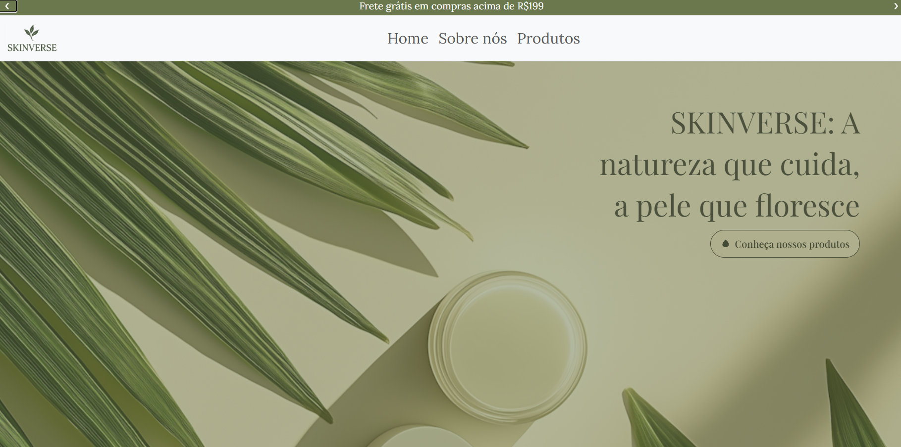
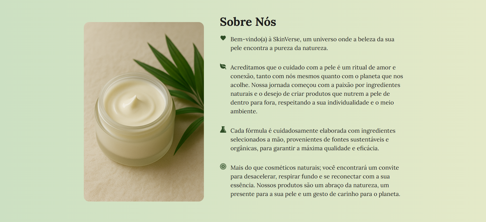
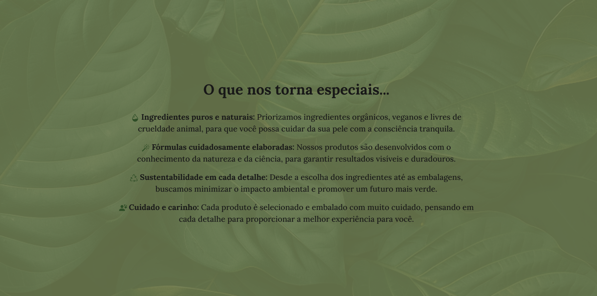
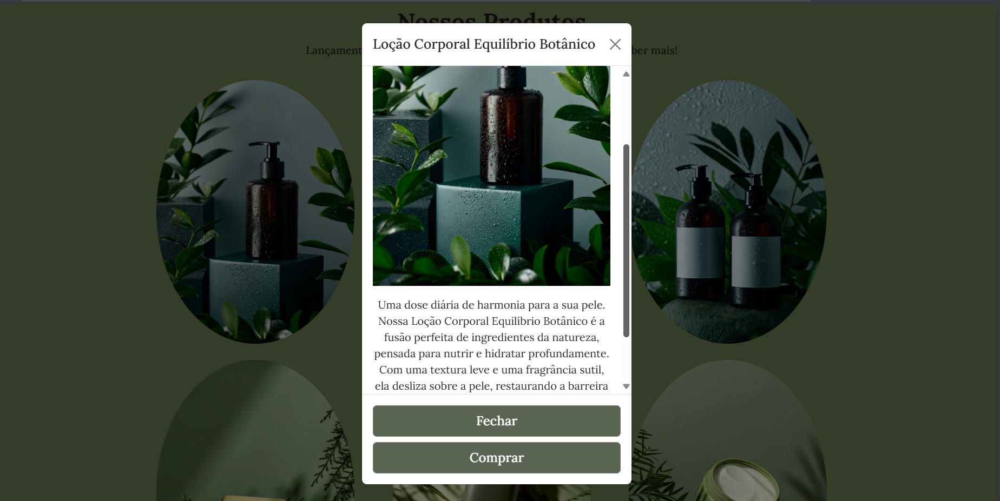
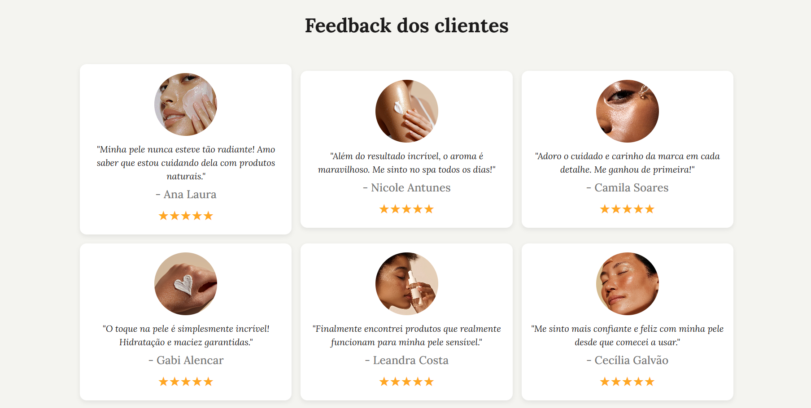

# 🌿 SkinVerse – Cosméticos Naturais

SkinVerse é um projeto de site fictício voltado para a apresentação de uma marca de cosméticos naturais. Desenvolvido com foco em um design limpo, responsivo e com forte apelo visual, este projeto tem como objetivo demonstrar minhas habilidades em HTML, CSS, Bootstrap e JavaScript, além de sensibilidade estética na criação de experiências digitais voltadas para o consumidor.

## Descrição do Projeto

O site foi idealizado para representar uma marca que prioriza o cuidado com a pele, sustentabilidade e o uso de ingredientes naturais. Ele é dividido em seções estratégicas para transmitir a identidade da marca de forma clara, envolvente e funcional.

### Principais Seções:

- **Banner inicial:** mensagem de boas-vindas.
- **Sobre nós:** texto institucional que apresenta os valores e a proposta da marca.
- **Diferenciais da marca:** pontos que destacam a qualidade, ética e sustentabilidade.
- **Catálogo de produtos:** apresentação visual com modais interativos para descrição detalhada.
- **Depoimentos de clientes:** seção com feedbacks que reforçam a confiança e credibilidade da marca.

## 🛠️ Tecnologias Utilizadas

- **HTML5**
- **CSS3**
- **JavaScript**
- **Bootstrap** 

## Objetivo do Projeto

Desenvolvi esse projeto de forma autoral para adicionar ao meu portfólio. A proposta foi demonstrar:

- Capacidade de estruturar páginas web com foco em usabilidade.
- Atenção ao design e à experiência do usuário.
- Organização de código limpo e semântico.
- Criatividade na criação de marcas fictícias com identidade coerente.

## 📸 Preview

[Link do Deploy](https://skinverse-zeta.vercel.app/)

